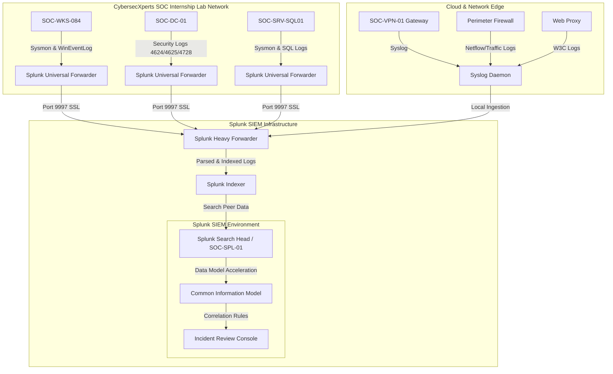

# CybersecXperts SOC Internship Lab - Enterprise Security Architecture

This document details the synthetic enterprise security architecture for the **CybersecXperts SOC Internship Lab**, serving as the baseline environment for the SOC L1-to-L2 Threat Detection, Investigation, and Incident Response Lab.

> [!IMPORTANT]
> All systems, networks, and services described below are fully synthetic and simulated within a training lab environment. No real production environment or corporate customer is represented.

---

## 1. Synthetic Environment Details

The environment simulates a standard corporate network layout for training and portfolio demonstration.

### Host and Subnet Allocation
*   **Active Directory Domain:** `soc-lab.local`
*   **User / Workstation Segment:** `10.20.10.0/24` (Workstations: `10.20.10.100 - 10.20.10.250`)
*   **Server Segment:** `10.20.20.0/24`
*   **Security Management Segment:** `10.20.30.0/24`
*   **VPN Client Pool:** `172.20.50.0/24`
*   **DMZ Subnet:** `192.168.20.0/24` (Public infrastructure)

### Key Assets and Identities

| Asset Name | IP Address | Operating System | Description / Purpose |
| :--- | :--- | :--- | :--- |
| `SOC-DC-01` | `10.20.20.10` | Windows Server 2022 | Primary Domain Controller / Active Directory |
| `SOC-DNS-01` | `10.20.20.11` | Windows Server 2022 | Active Directory DNS Server |
| `SOC-SRV-APP01` | `10.20.20.20` | Windows Server 2019 | Internal Application Server |
| `SOC-SRV-SQL01` | `10.20.20.30` | Windows Server 2019 | Sensitive Database Server containing simulated transaction logs |
| `SOC-WKS-084` | `10.20.10.142` | Windows 10 Enterprise | Employee Workstation assigned to Sarah Jenkins |
| `SOC-WKS-012` | `10.20.10.112` | Windows 10 Enterprise | Workstation assigned to Tom Davis (IT Admin) |
| `SOC-SPL-01` | `10.20.30.10` | Ubuntu 22.04 LTS | Splunk SIEM Server |
| `SOC-VPN-01` | `192.168.20.20` | Cisco ASA (Virtual) | VPN Gateway |
| `SOC-WEB-01` | `192.168.20.30` | Ubuntu Linux (Apache) | Public Web Server |

### Key User Identities

| Username | Employee Name | Role | Access Level |
| :--- | :--- | :--- | :--- |
| `sjenkins` | Sarah Jenkins | IT Support Specialist | Local Admin, VPN access |
| `tdavis` | Tom Davis | Domain Administrator | Domain Admin, VPN access |
| `jdoe` | John Doe | Financial Analyst | Standard User |
| `mross` | Mike Ross | Compliance Officer | Standard User |

---

## 2. Simulated Threat Actor Infrastructure (External Scope)

The external systems tracked during the investigation are detailed below:

| IP Address / Domain | Entity Type | Classification | Notes |
| :--- | :--- | :--- | :--- |
| `securityupdate.soc-lab.example` | Domain | Malicious Phishing Redirect | Typo-squatted look-alike domain targeting the lab domain |
| `198.51.100.45` | IP Address | Phishing Web Server Host | Hosting the fake credential harvesting page |
| `203.0.113.88` | IP Address | Command & Control (C2) | Beaconing destination for the reverse shell agent |
| `95.213.255.1` | IP Address | External Host (Russia) | Source IP for the compromised VPN credentials |
| `185.220.101.5` | IP Address | TOR Exit Node (Germany) | Source IP for administrative group changes |

---

## 3. Log Ingestion & SIEM Architecture

### Log Data Source Design

The lab leverages standard Splunk inputs parsed to match the Splunk Common Information Model (CIM) guidelines where applicable:

1.  **Windows Authentication (`windows_auth.csv`):** Windows Security Event ID `4624` (Successful Logon), `4625` (Failed Logon), and group changes (`4728`, `4732`). Ingested into `index=windows` with `sourcetype=XmlWinEventLog:Security`.
2.  **Sysmon Process Execution (`sysmon_process.csv`):** Sysmon Event ID `1` (Process Creation), `10` (ProcessAccess), and `13` (Registry Value Set). Ingested into `index=sysmon` with `sourcetype=XmlWinEventLog:Microsoft-Windows-Sysmon/Operational`.
3.  **VPN Authentication (`vpn_auth.csv`):** Ingress VPN connection sessions from external gateway. Ingested into `index=vpn` with `sourcetype=cisco:asa`.
4.  **Firewall Traffic (`firewall_traffic.csv`):** Network egress traffic logs mapping source, destination, ports, and bytes. Ingested into `index=firewall` with `sourcetype=pan:traffic`.
5.  **Proxy Web Log (`proxy_web.csv`):** Outbound HTTP/HTTPS requests from workstations. Ingested into `index=proxy` with `sourcetype=squid`.
6.  **DNS Queries (`dns_queries.csv`):** Internal DNS requests resolved by the Domain Controller. Ingested into `index=dns` with `sourcetype=MSAD:NT:DNS`.
7.  **EDR Alerts (`edr_alerts.csv`):** Telemetry from endpoint agent highlighting process tampering or LSASS reads. Ingested into `index=edr` with `sourcetype=carbonblack:json`.
8.  **Email Security (`email_security.csv`):** Inbound mail server gateway details. Ingested into `index=email` with `sourcetype=cisco:esa`.
9.  **Threat Intel IOCs (`threat_intel_iocs.csv`):** CSV Lookup matching known hostile IPs/Domains/Hashes. Ingested into `index=threatintel` or saved as a lookup file (`threat_intel_iocs.csv`).
